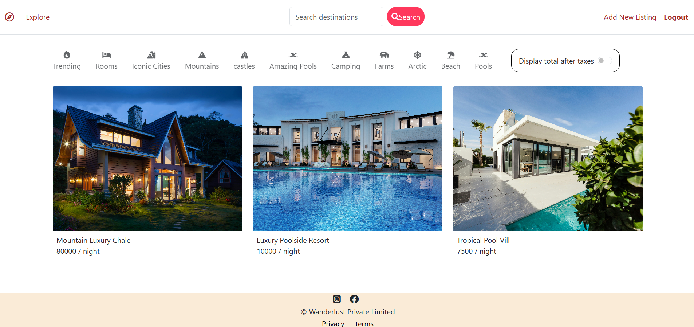

# StayFinder 

A full-stack Airbnb-inspired web application built with **Node.js, Express.js, MongoDB, Mongoose, and EJS**.

[](https://nodejs.org/)
[](https://expressjs.com/)
[](https://www.mongodb.com/)
[](https://mongoosejs.com/)
[](https://ejs.co/)

---

## Project Overview

This project was developed as part of my **full-stack web development learning journey with Apna College**.

The project demonstrates:

- Building a full-stack web application using **Node.js and Express.js**
- Creating and managing accommodation listings
- Implementing **CRUD operations**
- Working with **MongoDB and Mongoose**
- Implementing **user authentication and authorization**
- Using **MVC architecture** for backend organization
- Working with **Express.js middleware**
- Rendering dynamic pages using **EJS**
- Implementing reviews and ratings
- Handling form validation and errors
- Deploying a web application using **Render**

The main goal of this project was to gain practical experience in building a complete web application and understand how different backend and database concepts work together.

---

## Features

- Browse accommodation listings
- User authentication and authorization
- Create new listings
- Edit listings
- Delete listings
- Add and manage reviews
- Listing image management
- Listing categories
- Deployed on Render

---

## Technologies Used

[](https://developer.mozilla.org/en-US/docs/Web/HTML)
[](https://developer.mozilla.org/en-US/docs/Web/CSS)
[](https://developer.mozilla.org/en-US/docs/Web/JavaScript)
[](https://ejs.co/)
[](https://nodejs.org/)
[](https://expressjs.com/)
[](https://www.mongodb.com/)
[](https://mongoosejs.com/)
[](https://render.com/)

---

## What I Learned

Through this project, I gained practical experience in:

- Backend development with **Node.js and Express.js**
- Designing database schemas with **Mongoose**
- Performing **CRUD operations**
- Implementing **authentication and authorization**
- Building RESTful routes
- Working with middleware
- Structuring applications using **MVC architecture**
- Rendering dynamic content using **EJS**
- Handling validation and errors
- Connecting a web application with **MongoDB**
- Deploying a full-stack application on **Render**
---


## Project Structure

```text
StayFinder/
├── controller/          # Handles application/business logic
│   ├── listing.js       # Listing-related operations
│   ├── review.js        # Review-related operations
│   └── user.js          # User/authentication operations
│
├── init/                # Database initialization/seed data
│
├── models/              # MongoDB/Mongoose data models
│   ├── listing.js       # Listing schema and model
│   ├── review.js        # Review schema and model
│   └── user.js          # User schema and model
│
├── public/              # Static frontend files
│   ├── css/             # Stylesheets
│   └── js/              # Client-side JavaScript
│
├── routes/              # Defines application routes
│   ├── listing.js       # Listing routes
│   ├── review.js        # Review routes
│   └── user.js          # User/auth routes
│
├── utils/               # Reusable utility/helper functions
│
├── views/               # EJS templates/pages
│   ├── includes/        # Reusable EJS components
│   ├── layouts/         # Common page layouts
│   ├── listings/        # Listing-related pages
│   ├── users/           # User/authentication pages
│   └── error.ejs        # Error page
│
├── .gitignore           # Files ignored by Git
├── app.js               # Main Express application
├── cloudconfig.js       # Cloud/image service configuration
├── middleware.js        # Custom middleware
├── package.json         # Project dependencies and scripts
├── package-lock.json    # Locked dependency versions
├── schema.js            # Validation schemas
└── README.md            # Project documentation
```

---

## Getting Started

### Prerequisites

Make sure you have the following installed:

- [Node.js](https://nodejs.org/)
- npm
- MongoDB
- Git

### 1. Clone the Repository

```bash
git clone https://github.com/kirankutmure66/StayFinder.git
```

### 2. Navigate to the Project

```bash
cd StayFinder
```

### 3. Install Dependencies

```bash
npm install
```

### 4. Configure Environment Variables

Create a `.env` file in the root directory and add the required environment variables.

```env
ATLASDB_URL=your_mongodb_connection_string
SECRET=your_session_secret
```

Add any additional environment variables required by your configuration.

### 5. Start the Application

```bash
node app.js
```

For development with Nodemon:

```bash
nodemon app.js
```

### 6. Open in Browser

```text
http://localhost:8080/listing
```

---

## Future Improvements

The following features can be added in future versions:

- Search functionality
- Advanced listing filters
- Location-based search
- Booking and availability management
- Online payment integration
- Further improvements to mobile responsiveness
- Enhanced review and rating features

---

## Screenshots




---

##  Learning Outcome


The project helped me understand how **frontend views, backend routes, controllers, middleware, authentication, and database operations** work together in a real-world application.

It also gave me hands-on experience with **deployment, debugging, validation, and structuring a scalable backend application**.

---

## Author

**Kiran Kutmure**

GitHub: https://github.com/kirankutmure66

---

## Acknowledgement

This project was developed during my **Apna College full-stack web development learning journey** and was an important hands-on project for strengthening my understanding of backend and full-stack development.
